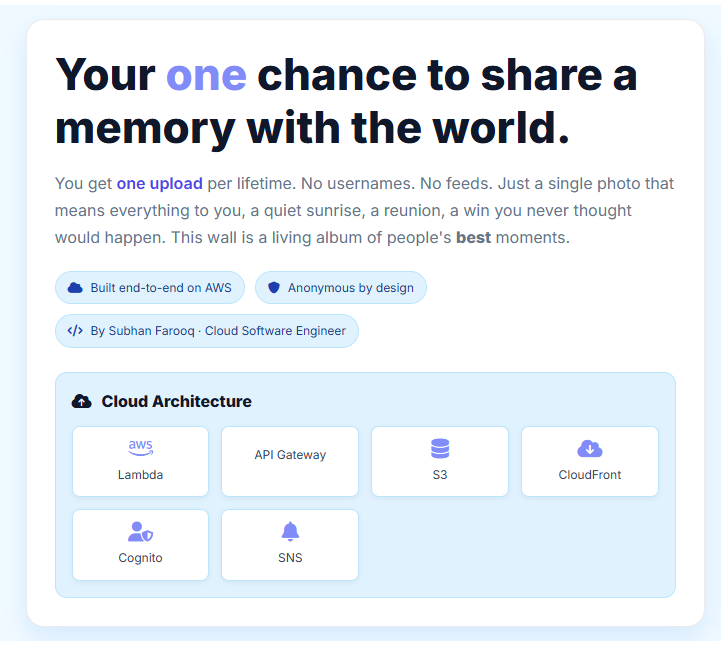
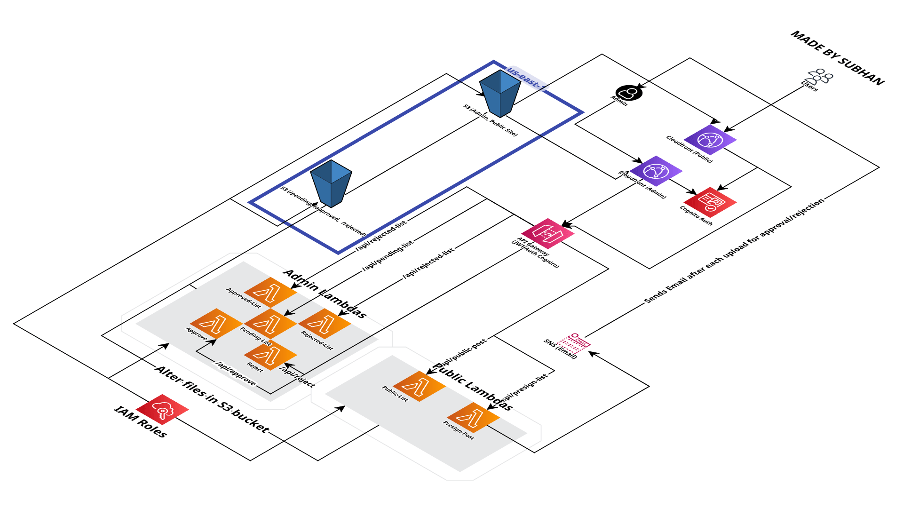
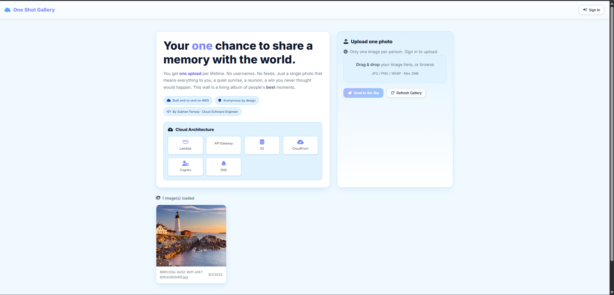
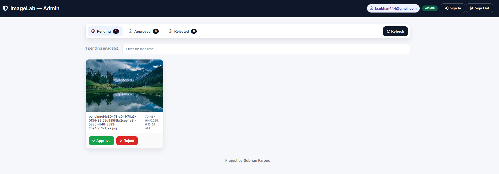

# 🌌 One Shot Gallery — Built on AWS
*A living wall of people’s favorite memories. Upload **one** photo — your best — anonymously. Curated and delivered by a fully serverless AWS stack.*

> **By Subhan Farooq — Cloud Software Engineer**  
> _“You only get one shot — make it your best.”_

---

## 🔗 Live URLs

- **Public Gallery:** https://d2kvyx5urqn7yh.cloudfront.net  
- **Admin Portal:** https://d3c6k5dylm8spf.cloudfront.net

---

## 🧠 Concept & Story

This app explores a simple but powerful idea: each person gets **one chance** to share a memory that matters. No usernames, no endless feeds — just a single photo that captures a moment.

From a cloud engineering perspective, it demonstrates:

- Secure, least-privilege, production-style **serverless** architecture  
- OAuth2 **Authorization Code + PKCE** via **Cognito Hosted UI**  
- **S3 presigned POST** upload flow with strict size/type constraints  
- **Moderation** workflow (`pending` → `approved` | `rejected`) with IAM isolation  
- Practical **CORS**, **IAM**, **JWT claims**, and **CloudFront** troubleshooting

---

## ☁️ Architecture Overview

**AWS Services**

- **Amazon S3** — Static hosting for Public/Admin sites; object storage for images  
  - Folders: `pending/<userId>/…`, `approved/<userId>/…`, `rejected/<userId>/…`
- **Amazon CloudFront** — CDN for both frontends & signed image delivery
- **Amazon Cognito** — User Pool + Hosted UI (**Authorization Code + PKCE**)  
  - Public users must sign in to upload  
  - **Admins** are managed via a Cognito **group**
- **Amazon API Gateway (HTTP API)** — Front door for Lambdas
- **AWS Lambda (Python 3.12)** — Business logic (presign, gallery, admin list/approve/reject)
- **Amazon SNS (optional)** — Email notification when a new upload arrives

---

## 🖥 Frontend Apps (S3 + CloudFront)

### Public Gallery
- Browse **approved** photos
- Sign in via Hosted UI (Cognito)
- Upload **one** image (`image/jpeg`, `image/png`, `image/webp`, ≤ **2 MB**)
- Drag-and-drop + preview

### Admin Portal
- Cognito login required  
- Must be in **Admins** (group name check is *case-insensitive*)  
- Tabs: **Pending / Approved / Rejected**  
- Approve/Reject directly from **Pending**

---

## ⚙️ Configuration (High-Level)

**Required values**
- **API base URL** (API Gateway stage)
- **Cognito Hosted UI domain** and **App Client ID**
- **AWS Region**
- **Public site domain** (CloudFront)  
- **Admin site domain** (CloudFront)
- **Allowed callback & sign-out URLs** in Cognito (must be **exact** and include any trailing `/` or `index.html` if used)

**Cognito (Hosted UI + PKCE)**
- App client type: **Public / SPA** (no client secret)  
- Identity provider: **Cognito User Pool**  
- OAuth grant: **Authorization Code (with PKCE)**  
- Scopes: **openid**, **email** (and **profile** if desired)  
- Callback & sign-out URLs: include your **exact** local dev URL and production domains  
- Create **Admins** group and add admin users (group name check is case-insensitive in backend/UI)

**Upload constraints**
- **One upload per user** (enforced server-side across `pending/`, `approved/`, `rejected/`)  
- Allowed content types: `image/jpeg`, `image/png`, `image/webp`  
- Max size: **2 MB**

---

## 🔌 API Surface (Overview)

| Method | Path                | Auth                  | Purpose                                    |
|:------:|---------------------|-----------------------|--------------------------------------------|
| GET    | `/gallery`          | Public                | List approved images (signed URLs)         |
| POST   | `/presign-upload`   | **Bearer** (ID token) | Issue presigned **POST** for image upload  |
| GET    | `/admin/pending`    | Admin (JWT)           | List pending images                        |
| GET    | `/admin/approved`   | Admin (JWT)           | List approved (admin view)                 |
| GET    | `/admin/rejected`   | Admin (JWT)           | List rejected (admin view)                 |
| POST   | `/admin/approve`    | Admin (JWT)           | Move `pending/…` → `approved/…`            |
| POST   | `/admin/reject`     | Admin (JWT)           | Move `pending/…` → `rejected/…`            |

> **Note:** Admin endpoints require a valid Cognito ID token whose `cognito:groups` includes **admins**/**Admins** (checked case-insensitively).

---

## 🧪 Testing Tips (No Code)

- **Sign in** via the Hosted UI from the Public site to obtain a valid session.  
- **Upload** a small test image (≤ **2 MB**) after authentication.  
- **Verify** there is at most one object across `pending/`, `approved/`, `rejected/` for your user (one-shot rule).  
- As an **Admin**, open the Admin Portal and **Approve/Reject** from **Pending**.  
- Confirm that images **move** between S3 prefixes and **appear** in the Public Gallery after approval.

---

## 🐛 Troubleshooting Log (What I Hit & How I Fixed It)

1. **`verifyPassword` 400 during login**  
   - **Cause:** App client not enabled for OAuth2/OIDC **or** callback URL mismatch.  
   - **Fix:** Enable **Authorization Code + PKCE**, set Cognito User Pool IdP, add **exact** callback/sign-out URLs, then clear cookies/storage for the Cognito domain.

2. **`redirect_mismatch` / trailing slash**  
   - **Symptom:** Hosted UI shows “Something went wrong”.  
   - **Fix:** The redirect URI must match **exactly** (including `/` or `index.html`). Add the precise string used by your app.

3. **CORS blocked**  
   - **Symptom:** Browser blocks API or S3 POST.  
   - **Fix:** Enable CORS in **API Gateway**/**Lambda** responses and S3 **CORS** for static assets & **POST** uploads.

4. **`AccessDenied` on `s3:ListBucket`**  
   - **Symptom:** Lambda logs show not authorized.  
   - **Fix:** Grant `ListBucket` with **prefix conditions** for expected folders, plus `GetObject`/`HeadObject` on those prefixes.

5. **Presign fails on file type/size**  
   - **Symptom:** Request rejected due to missing/invalid content type or size.  
   - **Fix:** Enforce a clear Content-Type policy and content-length range on the presign path; map content type → file extension consistently.

6. **Admin 403 despite group membership**  
   - **Cause:** Token had `["admins"]` but check was for `Admins`.  
   - **Fix:** Treat the **group name case-insensitively** on both backend and UI.

---

## 🚀 Deploy Steps (High-Level)

**S3**
- Bucket A: **Public** site (e.g., `index.html`, assets, images)  
- Bucket B: **Admin** site  
- Bucket C: **Image storage** with `pending/`, `approved/`, `rejected/`  
- Configure **S3 CORS** to allow your CloudFront origins and S3 **POST** uploads

**CloudFront**
- Create **two** distributions (Public & Admin) pointing to their S3 origins  
- Set **Default Root Object** to `index.html`  
- Tune caching and add error responses as needed

**Cognito**
- Create **User Pool** and **App Client (SPA)** with **Authorization Code + PKCE**  
- Add **exact** Callback/Sign-out URLs for local dev and production  
- Create **Admins** group and add admin users

**API Gateway + Lambda**
- Create functions for: presign, gallery list, admin list, approve, reject  
- Attach **least-privilege IAM** roles per function (separate permissions per prefix/action)  
- Configure **JWT authorizer** (Cognito), wire up routes, and enable **CORS**  
- Deploy to a stage and record the stage URL for the frontends

**SNS (Optional)**
- Create a topic; subscribe your email  
- Provide the topic ARN to the presign Lambda as an environment variable for notifications

---

## 🔒 Security Notes

- **One upload per user** is enforced server-side by checking all three prefixes (`pending/`, `approved/`, `rejected/`) for that user.  
- Presigned **POST** includes **content-length** and **Content-Type** constraints.  
- **JWT** is validated at API Gateway; backends trust only `requestContext.authorizer.jwt.claims`.  
- **IAM** follows the **principle of least privilege** with separate roles for public, presign, and admin paths.  
- Only **Admins** can list or act on **pending/rejected**; the public sees **approved** only.

---

## 🗂 Suggested Repository Layout (Illustrative)

- `README.md`  
- `public/` — Public SPA (HTML/JS, images)  
- `admin/` — Admin SPA (HTML/JS)  
- `lambda/` — Functions for presign, gallery, admin list/approve/reject  
- `images/` — Screenshots referenced in this README  
  - `hero.png`, `public.png`, `pending.png`, `gallery.png`, `architecture.png`

> Replace screenshots with your own; paths above assume `./images/...`.

---

## 👤 Social / Portfolio

- **LinkedIn:** https://www.linkedin.com/in/subhan-farooq/  
- **GitHub:** https://github.com/subhan-uf  
- **Portfolio:** https://subhans-portfolio.netlify.app/  
- **Upwork:** https://www.upwork.com/freelancers/~013c4624f8a8ad944b

---

## 📄 License

**MIT © Subhan Farooq**
